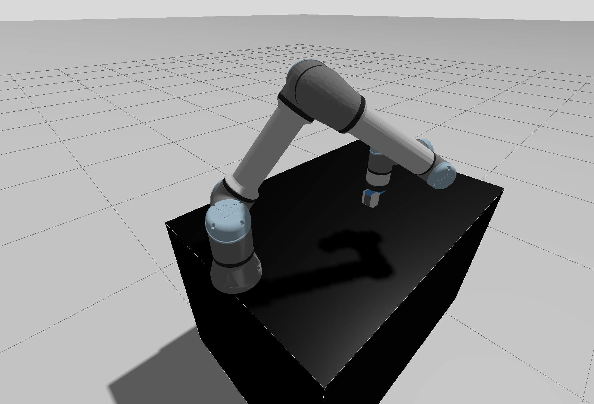
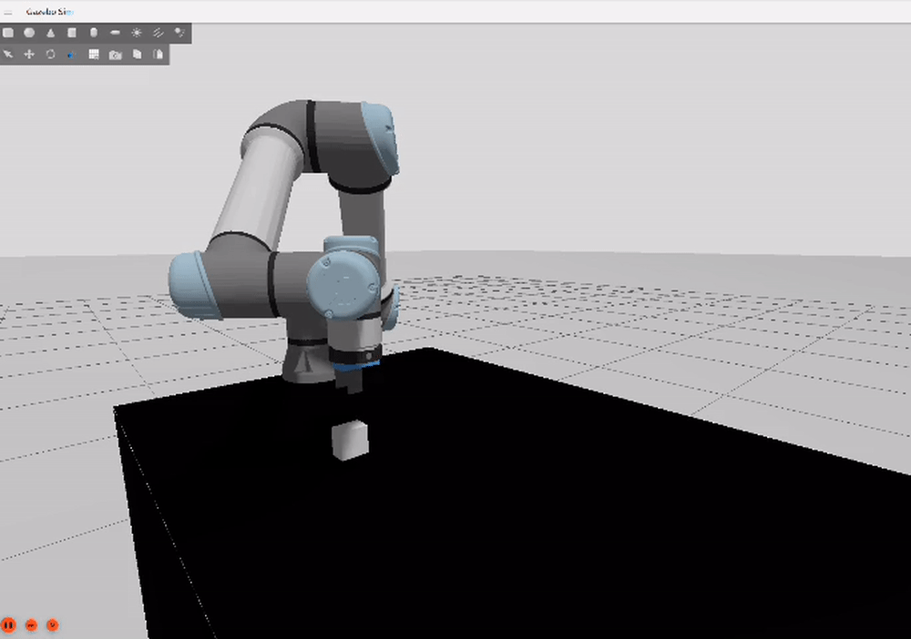
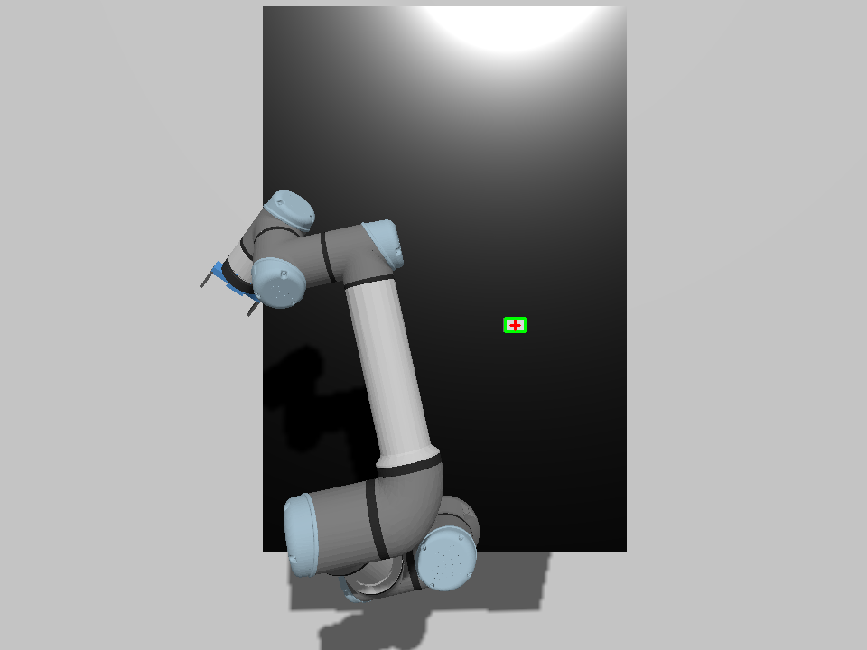

# Perception-Driven Robotic Manipulation with UR5e

A simulated UR5e arm that finds an object with an overhead RGB-D camera,
plans a grasp with MoveIt 2, and picks it up, transports it, and places it
down, with every result checked against Gazebo ground truth rather than a
node's own status message.

`ROS 2 Jazzy | MoveIt 2 | Gazebo Harmonic | C++ | Python | RGB-D Perception`

<p align="center">
  
</p>

## Demo

<p align="center">
  
</p>

*Perception-driven UR5e pick-and-place cycle in Gazebo Harmonic.*

## Overview

The scene is a UR5e on a table with one object at a fixed height. A camera
mounted above the workspace looks straight down. The pipeline:

1. **Localize** the object from RGB-D data, without using its known simulated
   pose.
2. **Select a grasp approach** — one of several IK solutions for the
   pregrasp pose, chosen deterministically rather than by whatever the
   planner returns first.
3. **Plan and execute** the approach and a Cartesian descent with MoveIt 2.
4. **Grasp** with a simulated parallel-jaw gripper, **lift**, **transport**,
   and **place** the object at a second location, then **release**.
5. **Evaluate** the result against the object's actual simulated pose —
   never against the pipeline's own reported success.

The gripper is a simplified single-DOF parallel-jaw model, not the vendor
Robotiq linkage. `docs/GRIPPER_REDESIGN_DESIGN.md` explains why: Gazebo's
default physics engine (DART) does not enforce mimic-joint constraints, which
made the original multi-link gripper's finger motion depend on a software
workaround that could fail under contact load. The parallel-jaw model has
exactly one actuated joint and two flat pads, so its geometry is provable
offline instead of measured after the fact.

## System Pipeline

```mermaid
flowchart LR
    A[RGB-D Camera] --> B[Object Detection]
    B --> C[Camera-to-World Transform]
    C --> D[Grasp Target Construction]
    D --> E[Deterministic Pregrasp / IK Selection]
    E --> F[MoveIt 2 Planning]
    F --> G[Cartesian Descent]
    G --> H[Grasp]
    H --> I[Lift]
    I --> J[Transport]
    J --> K[Release]
    K --> L[Ground-Truth Evaluation]
```



## Key Features

- **Perception-driven object localization.** A depth-plane segmentation
  detector estimates the object's visible top-surface position from RGB-D
  data (`object_detector.cpp`), and a separate node transforms it into the
  world frame with TF2 (`object_position_world.cpp`). Neither node reads
  Gazebo's ground-truth object pose.

<p align="center">
  
</p>

*RGB-D object detection showing the detected object bounding box and 2D/3D centroid.*

- **Deterministic pregrasp / IK branch selection.** Multiple IK solutions
  can reach the same pregrasp pose; a fixed selection rule picks one so the
  same scene always produces the same approach, rather than depending on
  planner internals.
- **MoveIt 2 / OMPL planning** for the free-space legs (pregrasp, transit,
  transport), and a **Cartesian path** for the final descent and the
  place-descent, so the last few centimetres of motion are a straight line
  rather than a planned trajectory.
- **Parallel-jaw grasp geometry** with a closed-form aperture/TCP-offset
  relationship (`scripts/lib/parallel_jaw_geometry.py`), instead of a
  numerically-fit constant.
- **Quantitative ground-truth validation.** Every run is checked against
  Gazebo's own object and flange poses — perception error, grasp aperture,
  lift/transport slip, placement error, and final orientation error are all
  measured, not inferred from a status flag.
- **Repeatability and position-generalization campaigns** (below), plus
  diagnostic tooling for isolating planner, controller, and perception
  behavior independently (`scripts/`, `scripts/perception/`).

## Validation Results

All reported results are from simulation.

| Check | Result |
|---|---|
| Scene-A repeatability | **5 / 5 cycles PASS** (2026-08-27, fixed object pose) |
| Position generalization (G1–G5) | **5 / 5 poses PASS** (2026-08-27/28, five distinct XY object positions) |
| Post-cleanup regression | **1 / 1 PASS** (2026-08-28) — confirms the cleaned repository still reproduces the validated cycle; not an additional repeatability or generalization data point |
| Perception error | acceptance threshold < 3 mm; measured 1.47–1.76 mm across G1–G5, 1.6134 mm in the repeatability campaign |
| Cartesian descent fraction | 1.0000 in every cited run |
| Grasp aperture | 29.9995 mm, against a 30 ± 1 mm target |
| Lift slip | sub-millimetre in every cited run (max 0.0521 mm) |
| Transport slip | sub-millimetre in every cited run (max 0.0815 mm) |
| Placement error | approximately 2 mm in every cited run (range 1.89–2.20 mm) |

**On G1–G5 homogeneity:** G1–G4 ran with MoveIt's `plan_attempts = 20`; the
final G5 qualification ran with `plan_attempts = 1` (a diagnosability change,
not a planning-quality change — see Known Limitations). The five-pose
campaign is therefore evidence of position generalization under two
adjacent planner-attempt settings, not one strictly uniform configuration.

Full per-run figures are in `HANDOFF.md` and `PROJECT_STATE.md`.

## Stage-1 Experimental Scope

Stage 1 demonstrated perception-driven pick-and-place across **five distinct
XY object positions**, with the object's geometry, height, and orientation
held fixed and the same manipulation task repeated at each position.

**Not yet demonstrated:**

- perception or manipulation under arbitrary object **orientation** (yaw) —
  planned as Stage 2, not started;
- object **size** variation beyond the two configurations already tested
  (30 mm / 45 mm cube);
- transfer to a **real robot** — everything above is simulation-only;
- robustness to broader **environmental** variation (lighting, clutter,
  multiple objects, occlusion).

## Architecture / Packages

- **`ur5e_pick_place`** — the application layer: the perception nodes
  (`object_detector`, `object_position_world`), the pick-place state machine
  (`m3_grasp.cpp`, `transport.cpp`), and the launch files that wire them
  together.
- **`ur5e_robotiq_description`** — the robot model: the merged UR5e +
  gripper URDF/xacro (both the vendor Robotiq linkage and the parallel-jaw
  model, selected by a launch argument), the overhead camera, controller
  configuration, and the Gazebo world.
- **`ur5e_robotiq_moveit_config`** — the MoveIt 2 configuration for both
  gripper models: planning groups, kinematics, and controller mapping.

## Repository Structure

```
config/                       scene.yaml — single source of truth for object
                               pose, grasp geometry, and pipeline thresholds
docs/                         design documents and milestone handoffs
scripts/                      setup, diagnostic, and validation tooling
  scripts/perception/         the perception-milestone and campaign harnesses
ur5e_pick_place/               application code and launch files
ur5e_robotiq_description/      robot model, controllers, Gazebo world
ur5e_robotiq_moveit_config/    MoveIt 2 configuration
```

Raw experiment output under `evidence/` (Gazebo pose streams, per-run logs,
CSVs — several gigabytes) is intentionally excluded from Git. Durable
results are recorded as text in `HANDOFF.md` and `PROJECT_STATE.md`, not as
committed raw data.

## Requirements

- Ubuntu 24.04 (Noble)
- ROS 2 Jazzy Jalisco
- Gazebo Harmonic
- MoveIt 2
- colcon
- OpenCV, `cv_bridge`, `message_filters` (for the perception nodes)

`scripts/02_bootstrap_noble.sh` installs the full ROS/Gazebo environment on a
clean Ubuntu 24.04 machine, including `rosdep`-resolved package
dependencies.

## Build

The repository root is itself the colcon workspace — the three ROS packages
live directly under it, with no separate `src/` layout required.

```bash
cd ~/ur5e_pickplace
source /opt/ros/jazzy/setup.bash
colcon build --symlink-install
source install/setup.bash
```

## Running the System

The validated baseline requires the parallel-jaw gripper and perception
explicitly enabled — the launch files default to the older vendor gripper
with perception off, for backward compatibility with the classical
(non-perception) pipeline described in `docs/HANDOFF_M3.md`.

**One complete perception-driven cycle, single command:**

```bash
cd ~/ur5e_pickplace
source /opt/ros/jazzy/setup.bash
source install/setup.bash
REPEATABILITY_CYCLES=1 python3 scripts/perception/run_5_cycles.py
```

This is the same harness that produced the 5/5 repeatability and Stage-1
results: it brings up the simulation and controllers with
`gripper_model:=parallel_jaw`, starts MoveIt, spawns the object, starts the
perception nodes, runs one full perception-driven cycle, evaluates the
result against Gazebo ground truth, and shuts everything down. Set
`REPEATABILITY_CYCLES` to a higher number to repeat it.

**The same sequence by hand, to watch each stage in the Gazebo GUI** (four
terminals, run in order):

```bash
# Terminal 1 — simulation, controllers, camera
ros2 launch ur5e_robotiq_description ur5e_robotiq_sim_control.launch.py \
  gripper_model:=parallel_jaw enable_camera:=true gazebo_gui:=true

# Terminal 2 — MoveIt (after the controllers report active)
ros2 launch ur5e_robotiq_moveit_config move_group.launch.py \
  gripper_model:=parallel_jaw

# Terminal 3 — perception nodes (after move_group is up)
ros2 run ur5e_pick_place object_detector --ros-args -p use_sim_time:=true
ros2 run ur5e_pick_place object_position_world --ros-args -p use_sim_time:=true

# Terminal 4 — spawn the object, then run the pick-place cycle
bash scripts/08_spawn_pick_object.sh
ros2 launch ur5e_pick_place m3_grasp.launch.py \
  gripper_model:=parallel_jaw use_perceived_position:=true require_perception:=true
```

`m3_grasp.launch.py` does not exit on its own once the cycle finishes — end
the session with Ctrl+C.

## Validation / Reproduction

`scripts/perception/run_5_cycles.py` (above) is the general-purpose
reproduction path — it accepts `REPEATABILITY_CYCLES` for a repeatability
run at the fixed Scene-A pose. The Stage-1 position-generalization campaign
used the same underlying harness, `scripts/perception/milestone_f1_harness.py`,
with the object spawned at each of the five G1–G5 positions in turn.
`scripts/perception/evaluate_placement.py` scores a completed run's
placement against the configured target.

These campaigns generate substantial ground-truth logging; the single-cycle
command above is the right default rather than a multi-cycle sweep.

## Known Limitations

- **Simulation only.** Nothing here has run on physical hardware.
- **Object orientation was fixed during Stage 1.** All five validated
  positions used the same object yaw; the perception pipeline has not been
  evaluated against orientation variation.
- **Perception currently validates position, not orientation.** The
  detector estimates the object's top-surface position; no yaw or
  orientation estimation exists in the current pipeline.
- **One historical planner anomaly remains open.** A single MoveIt/OMPL
  transport-planning attempt took 15.001 s and returned `PLAN_FAILURE`
  during an earlier G5 trial, after perception, grasp, and lift had already
  succeeded. It did not reproduce across two later G5 runs, and an offline
  investigation ruled out IK goal-sampling starvation as the cause. It
  remains unexplained. A related configuration change
  (`plan_attempts: 20 → 1`) was made for diagnosability — so a future
  recurrence would produce a usable planner status — not as a fix, and is
  not claimed as one.
- **Stage 2 (object orientation generalization) has not started.**

## Current Status

- **Stage 1 — Position generalization: COMPLETE / PASS.**
- **Stage 2 — Orientation generalization: planned, not started.**

## Documentation

- [`PROJECT_STATE.md`](PROJECT_STATE.md) — current validated state, updated
  as results change.
- [`HANDOFF.md`](HANDOFF.md) — full session-by-session record of every
  measurement and decision behind the current state.
- [`docs/HANDOFF_RGBD_PERCEPTION.md`](docs/HANDOFF_RGBD_PERCEPTION.md) —
  the perception pipeline's validation record, milestone by milestone.
- [`docs/GRIPPER_REDESIGN_DESIGN.md`](docs/GRIPPER_REDESIGN_DESIGN.md) —
  the architecture analysis and design rationale behind the parallel-jaw
  gripper.

## Author

Sachin Kumar Pal
M.Sc. Mechatronics and Cyber-Physical Systems
Deggendorf Institute of Technology

[GitHub](https://github.com/Sachin6120)
