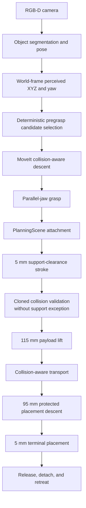

# UR5e Perception-Guided Pick-and-Place

A simulated pick-and-place system for a UR5e with a parallel-jaw gripper. It
uses ROS 2 Jazzy, Gazebo Harmonic, MoveIt 2, and RGB-D perception to generalize
the grasp across planar XY offsets and axial object yaw while managing the
object's complete PlanningScene lifecycle.

The validated scope is simulation-only planar pose generalization. It is not a
safety-certified or production-certified robotics system.

## Demo

The validated D3 case has a one-command visual launch:

```bash
source /opt/ros/jazzy/setup.bash
source ~/ur5e_pickplace/install/setup.bash
ros2 launch ur5e_pick_place d3_demo.launch.py
```

The launch orchestrates the Gazebo GUI, controllers, MoveIt, RViz, RGB-D
perception, the D3 object spawn, manipulation, evidence/analyzer processes,
and teardown. It has been validated from this repository's symlink-install
workspace; copied-install portability has not yet been established.

<!-- Future D3 media target: docs/assets/d3_demo_thumbnail.png. The full MP4
     should be published as a GitHub Release asset, not committed to Git. -->

## Pipeline



Ground truth is used only to evaluate the run. It is not an input to
perception, grasp selection, or planning.

## PlanningScene Lifecycle

The collision matrix uses three narrowly scoped exception classes:

- `P = table ↔ base_link_inertia`: permanent table/base exception.
- `C1 = pick_target ↔ pad_fixed_link` and
  `C2 = pick_target ↔ pad_moving_link`: enabled only for grasp closure.
- `S = pick_target ↔ table`: temporary support exception.

The validated lifecycle is:

```text
world target
→ collision-protected descent
→ enable C1/C2 only for closure
→ attach target to gripper_base_link (touch links: exactly the two pads)
→ remove C1/C2 and enable S
→ 5 mm pickup clearance
→ clone the scene, remove S in the clone, and collision-check
→ remove live S
→ 115 mm lift and collision-aware transport
→ 95 mm placement descent with S absent
→ verify positive pre-contact separation
→ enable S only for the final 5 mm
→ release, detach to the world, and retreat
```

This lifecycle demonstrates explicit collision-state management in the
validated simulation; it is not a claim of formal safety certification.

## Validation

| Case | XY offset | Yaw | Result |
|---|---:|---:|:---:|
| Scene-A | 0, 0 mm | 0 deg | PASS |
| D1 | +30, +30 mm | +30 deg | PASS |
| D2 | -30, -30 mm | -30 deg | PASS |
| D3 | +30, -30 mm | +45 deg | PASS |

Scene-A is the lifecycle-integrated baseline. D1, D2, and D3 are the 3/3
Stage-2D planar XY+yaw regression cases.

| Verified metric | Scene-A | D1 | D2 | D3 |
|---|---:|---:|---:|---:|
| Perception error (mm) | 1.613 | 1.3900 | 1.2849 | 1.6104 |
| Perceived yaw error (deg) | 0.0000 | -0.0215 | -0.2371 | ≈0 (+0.000016) |
| Cartesian descent fraction | 1.0000 | 1.0000 | 1.0000 | 1.0000 |
| Descent TCP error (mm) | 0.00032 | 0.00028 | 0.00070 | 0.00071 |
| Pre-close contacts, fixed / moving | 0 / 0 | 0 / 0 | 0 / 0 | 0 / 0 |
| Grasp aperture (mm) | 30.0000 | 30.0022 | 30.0034 | 29.9995 |
| Pickup separation (mm) | +4.982 | +4.977 | +4.981 | +4.959 |
| Lift slip (mm) | 0.000 | 0.0101 | 0.0101 | 0.0107 |
| Transport slip (mm) | 0.000 | 0.0044 | 0.0027 | 0.0071 |
| Placement pre-contact separation (mm) | +4.954 | +4.994 | +4.940 | +4.968 |
| Placement position error (mm) | 1.613 | 2.0300 | 2.2234 | 1.9793 |
| Result | SUCCESS | PASS | PASS | PASS |

The D3 placement value above is the authoritative PlanningScene regression
result. A later recording-only demo run measured 2.1433 mm and is not used as
the qualification metric.

## D3 Failure → Root Cause → Fix

At the historical 1.5 mm fixed-side clearance, D3's governing fixed-side
projection was approximately 1.5759 mm:

```text
predicted margin = 1.5000 - 1.5759 ≈ -0.0759 mm
```

The negative margin produced a fixed-pad collision: an approximately 59.2 µm
contact sliver and approximately 301 N of simulated contact force. Cartesian
descent failed.

The production fixed-side clearance was corrected to 2.0 mm. With the
conservative working model margin
`Mmodel_working = 0.000001 mm`:

```text
predicted margin ≈ 2.0000 - 1.5759 - 0.000001 ≈ +0.4241 mm
```

The corrected D3 run verified zero fixed-pad pre-close contacts, zero
moving-pad pre-close contacts, a Cartesian descent fraction of 1.0000, and a
complete-cycle PASS. The working model margin is a design allowance, not a
measured uncertainty. See the
[clearance analysis](docs/evidence/d3_clearance_analysis.md) for the concise
engineering record.

## Startup Reliability Fix

A cold-start demo exposed a MoveIt `CurrentStateMonitor` race: the physical
robot was at M1, but a lazily initialized monitor could return a default zero
`RobotState` before a genuine `/joint_states` sample arrived.

The startup path now explicitly initializes the monitor, waits for a bounded
genuine `JointState` containing all required arm joints, returns
`STARTUP_STATE_UNAVAILABLE` when no valid sample arrives, and emits
`STARTUP_M1_VERIFIED` only after checking real state. The M1 tolerance remains
0.01 rad; no arbitrary startup sleep was added. The focused startup tests pass
10/10, and the current package suite passes 105/105.

## Tech Stack

- ROS 2 Jazzy
- Gazebo Harmonic
- MoveIt 2 with OMPL RRTConnect
- `ros2_control` and `gz_ros2_control`
- OpenCV
- C++ nodes and Python validation harnesses

## Build / Run

This repository is the colcon workspace. The validated development workflow
uses a symlink install:

```bash
cd ~/ur5e_pickplace
source /opt/ros/jazzy/setup.bash
colcon build --symlink-install
source ~/ur5e_pickplace/install/setup.bash
```

Then run the D3 command from [Demo](#demo). The demo launch currently resolves
repository-side scripts and configuration and therefore should be treated as
a workspace demo, not as a proven relocatable binary install.

## Tests

```bash
source /opt/ros/jazzy/setup.bash
source ~/ur5e_pickplace/install/setup.bash
colcon test --packages-select ur5e_pick_place
colcon test-result --verbose
```

Current baseline: **105 tests, 0 failures**.

## Repository Structure

```text
config/                        shared scene and manipulation parameters
docs/                          public docs and retained engineering history
  assets/                      repository-sized images
  evidence/                    compact public validation summaries
scripts/                       setup, diagnostics, and validation harnesses
  perception/                  perception and Stage-2D campaign tooling
ur5e_pick_place/               application nodes, launch files, and tests
ur5e_robotiq_description/      robot model, controllers, and Gazebo world
ur5e_robotiq_moveit_config/    MoveIt configuration
```

See the [documentation index](docs/README.md) for public guides and historical
engineering records.

## Limitations / Current Scope

- Generalization is validated for planar XY offsets and axial yaw, not full
  arbitrary SO(3) orientation.
- The validated scene contains one target object and is simulation-only.
- OMPL RRTConnect is stochastic and the current configuration uses one
  planning attempt.
- The `+0.5 px` shadow estimator is diagnostic and non-production.
- Gazebo ground truth is evaluation-only and never planning input.

## Evidence

The compact public evidence bundle is documented in
[docs/evidence/README.md](docs/evidence/README.md). Multi-gigabyte raw captures
remain local and are not committed to Git.

## License / Third-Party Assets

Licensing and third-party attribution are documented separately; see the
repository license and third-party notice once finalized.
